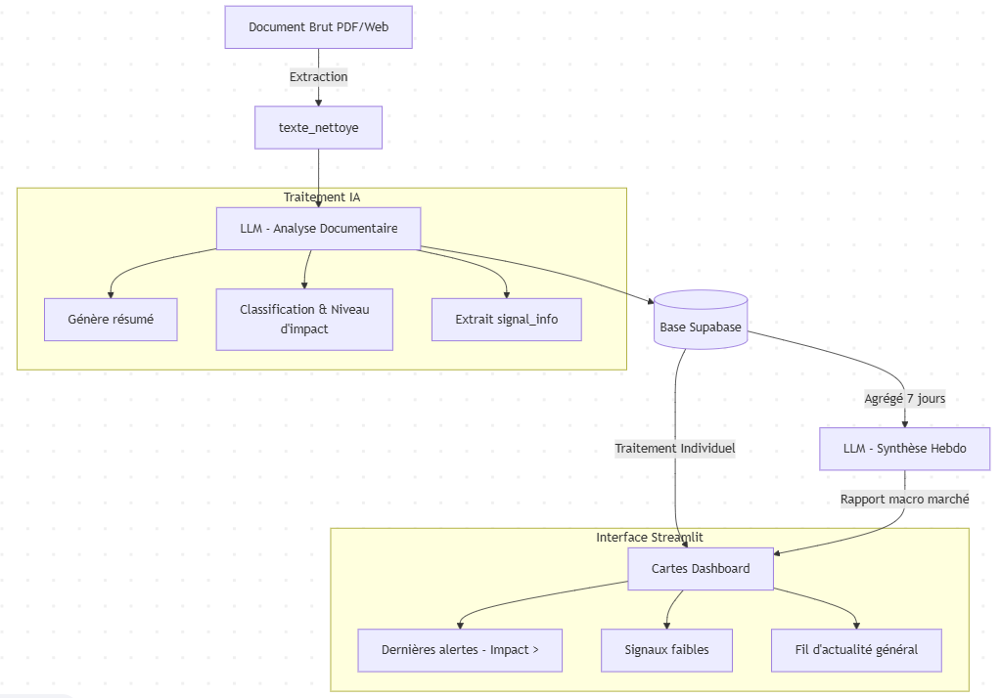

# Plateforme de Veille Financière

Veille financière augmentée par l'IA ciblant les sources institutionnelles marocaines (Bank Al-Maghrib, AMMC, Bourse de Casablanca). Le système collecte, nettoie, résume et classifie automatiquement les documents financiers pour en extraire des signaux faibles et des tendances.

## Prérequis
- Python 3.10+
- PostgreSQL (Local ou cloud via Supabase)

## Installation

**1. Cloner le projet**
```bash
git clone https://github.com/khalidiktib/Plateforme_de_Veille_Financiere.git
cd Plateforme_de_Veille_Financiere
```

**2. Environnement Python**
```bash
python -m venv .venv

# Windows
.venv\Scripts\activate

# Mac/Linux
source .venv/bin/activate

pip install -r requirements.txt
```

**3. Variables d'environnement**
```bash
cp .env.example .env
```
Remplir `DATABASE_URL` avec l'URL Supabase et `LLM_API_KEY` 
avec votre propre clé Groq gratuite.

**4. Tester l'installation**
```bash
python -m tests.test_infra
```

Résultat attendu :
✓ Connecté : PostgreSQL 16...
✓ Nettoyage : ...
✓ Hash : ...
✓ Langue détectée : fr
✓ Tout fonctionne — prêt pour les collectors

### 4. Lancer PostgreSQL via Docker
```bash
docker compose up -d
```

Vérifier que le container tourne :
```bash
docker ps
# Vous devez voir pvf-postgres avec status "Up"
```

### 5. Initialiser la base de données
```bash
docker exec -i pvf-postgres psql -U pvf_admin -d pvf_db < database/schema.sql
```

### 6. Tester l'installation
```bash
python -m tests.test_infra
```

Résultat attendu :
✓ Connecté : PostgreSQL 16.14
✓ Nettoyage : ...
✓ Hash : ...
✓ Langue détectée : fr
✓ Tout fonctionne — prêt pour les collectors

---

## Clé API Groq (obligatoire pour le NLP)

Chaque membre crée **ses propres clés gratuites** :

| Usage | Fournisseur | Où l'obtenir |
|---|---|---|
| Résumé + classification | Groq | https://console.groq.com |
| Extraction de signaux faibles | Gemini | https://aistudio.google.com/apikey |

```dotenv
LLM_API_KEY=gsk_...
GEMINI_API_KEY=AIza...
```

Les clés restent sur votre machine — ne jamais partager.

---

---

## Commandes utiles

```bash
# Tester l'infrastructure
python -m tests.test_infra

# Lancer un pipeline (exemple Bourse)
python -m collectors.bourse.bourse_pipeline

# Lancer le NLP sur les documents en attente
python -c "from nlp.run_nlp import run_nlp_pipeline; run_nlp_pipeline(limite=50)"

# Lancer la classification (risque / opportunité / neutre)
python -m nlp.run_classifier

# Lancer le dashboard
python -m streamlit run dashboard/app.py

# Extraction de signaux faibles
python -c "from nlp.run_signals import run_signals_pipeline; run_signals_pipeline(limite=50)"

# Rattraper les dates manquantes (AMMC)
python -m nlp.backfill_dates_ammc

# Vérifier l'état de la base (Supabase SQL Editor ou psql)
SELECT source, COUNT(*), 
       SUM(CASE WHEN statut_nlp='done' THEN 1 ELSE 0 END) as resumes,
       SUM(CASE WHEN mots_cles IS NOT NULL THEN 1 ELSE 0 END) as avec_signaux
FROM documents GROUP BY source;

# Vérifier les données en base
docker exec -it pvf-postgres psql -U pvf_admin -d pvf_db \
  -c "SELECT source, COUNT(*), SUM(CASE WHEN statut_nlp='done' THEN 1 ELSE 0 END) as resumes FROM documents GROUP BY source;"

# Arrêter Docker
docker compose down

# Redémarrer Docker (après redémarrage PC)
docker compose up -d
```

---

## Schéma de la base de données

Table principale `documents` :

| Colonne | Type | Description |
|---|---|---|
| id | SERIAL | Identifiant unique |
| source | VARCHAR | BAM / AMMC / BOURSE |
| type_document | VARCHAR | rapport / communique / resume_seance / ... |
| titre | TEXT | Titre du document |
| url_source | TEXT | URL d'origine |
| date_publication | DATE | Date de publication (voir cascade d'extraction ci-dessous) |
| langue | VARCHAR | fr / ar |
| texte_nettoye | TEXT | Texte extrait et nettoyé |
| hash | VARCHAR | Empreinte pour déduplication |
| resume | TEXT | Résumé généré par l'IA |
| classification | VARCHAR | RISQUE / OPPORTUNITE / NEUTRE |
| score_risque | INTEGER | 1 (faible) / 2 (modéré) / 3 (élevé) |
| mots_cles | JSONB | Signaux faibles extraits par le LLM (liste de termes) |
| statut_nlp | VARCHAR | pending / done / error |
| date_collecte | TIMESTAMP | Date d'insertion en base |
| metadata | JSONB | Données spécifiques à la source |

---

### Fiabilisation de `date_publication`

En cascade, par ordre de priorité :
1. Date extraite du titre du fichier (par le collector de la source)
2. Date extraite du contenu du PDF (`cleaners/date_extractor.py`)
3. Header HTTP `Last-Modified` du fichier source (`cleaners/http_date_extractor.py`)
4. À défaut, la colonne reste `NULL` — le document est exclu des requêtes 
   temporelles plutôt que de lui assigner une date approximative.

---

## Mécanisme des signaux faibles

Deux logiques distinctes à ne pas confondre :

- **`mots_cles` (colonne en base)** : décidés par le LLM à partir du texte 
  brut du document — extraction sémantique, pas une liste de mots fixée à 
  l'avance. Utilisés pour la détection automatique de tendances (comptage 
  d'occurrences sur 90 jours, toutes sources confondues).
- **Barre de recherche du dashboard** : recherche texte simple (`ILIKE`) 
  choisie par l'analyste, sur résumé/titre/texte. Aucun lien avec `mots_cles`.

Un signal est considéré comme fort quand il apparaît **dans plusieurs 
sources** sur la même période (badge "Multi-sources" dans le dashboard).


---

## Synthèse du flux d'architecture

<p align="center">
  
</p>
## Structure du Projet

```
Plateforme_de_Veille_Financiere
├─ cleaners
│  ├─ date_extractor.py
│  ├─ deduplicator.py
│  ├─ http_date_extractor.py
│  ├─ text_cleaner.py
│  └─ __init__.py
├─ collectors
│  ├─ ammc
│  │  ├─ ammc_collector.py
│  │  ├─ ammc_pipeline.py
│  │  └─ __init__.py
│  ├─ bam
│  │  ├─ bam_collector.py
│  │  ├─ bam_pipeline.py
│  │  ├─ test_bam.py
│  │  └─ __init__.py
│  ├─ bourse
│  │  ├─ bourse_collector.py
│  │  ├─ bourse_pipeline.py
│  │  └─ __init__.py
│  └─ __init__.py
├─ config
│  ├─ settings.py
│  └─ __init__.py
├─ dashboard
│  ├─ app.py
│  └─ __init__.py
├─ data
├─ database
│  ├─ add_alertes_synthese.sql
│  ├─ add_niveau_impact.sql
│  ├─ add_signal_info.sql
│  └─ schema.sql
├─ docker-compose.yml
├─ docs
├─ extractors
│  ├─ html_extractor.py
│  ├─ pdf_extractor.py
│  └─ __init__.py
├─ main.py
├─ nlp
│  ├─ backfill_dates_ammc.py
│  ├─ classifier.py
│  ├─ run_classifier.py
│  ├─ run_nlp.py
│  ├─ run_signals.py
│  ├─ run_synthese.py
│  ├─ script.py
│  ├─ signal_extractor.py
│  ├─ summarizer.py
│  ├─ synthese_hebdo.py
│  ├─ test_classifier.py
│  ├─ test_signal.py
│  └─ __init__.py
├─ README.md
├─ requirements.txt
├─ storage
│  ├─ db.py
│  ├─ migrate_to_supabase.py
│  ├─ repositories.py
│  └─ __init__.py
└─ tests
   ├─ test_infra.py
   └─ __init__.py

```